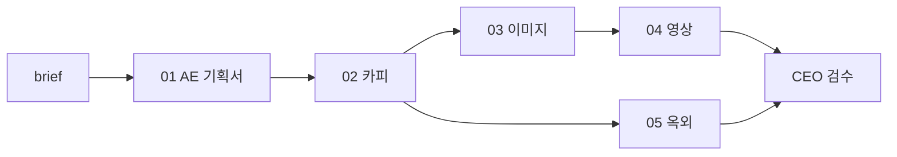

# Ad Agency — 순차 캠페인 파이프라인

Cursor **에이전트·스킬**로 AE → 카피 → 검수 3단계 캠페인을 만드는 프로젝트입니다.

한 번에 **한 팀만** 작업합니다. 이전 산출물이 `outputs/`에 저장된 뒤 다음 팀이 이어갑니다.

## 설치 (clone 후)

1. 이 repo를 clone하고 Cursor에서 폴더를 엽니다.
2. `brief/brand-brief.template.md` → `brief/brand-brief.md` 복사 후 작성.
3. 채팅: `/myagency` 또는 `내 캠페인 만들어줘`

## 시작 방법

1. `brief/brand-brief.template.md`를 복사해 `brief/brand-brief.md`를 채우거나, 채팅에 브리프를 붙여 넣습니다.
2. Cursor에서 예시처럼 요청합니다.

```
캠페인 파이프라인 시작해줘
```

또는 단계별:

```
AE야, 이 브랜드 기획서 만들어줘
```

(완료 후)

```
카피야, 이 기획서 보고 카피 써줘
```

```
이미지팀, 이제 네 차례야
```

… 동일하게 영상 → 옥외 → 대표 검수.

## 흐름



## 스킬 위치

| 스킬 | 역할 |
|------|------|
| `my-agency` | 3단계 파이프라인 오케스트레이터 (`/myagency`) |
| `my-ae` / `my-copywriter` / `my-reviewer` | `.cursor/agents/` 에이전트 |
| `ad-orchestrator` | 6단계 확장 파이프라인 (이미지·영상·옥외·CEO) |
| `ad-ae` | 방향성 기획서 |
| `ad-copywriter` | 핵심 카피 |
| `ad-image` | 이미지 시안 |
| `ad-video` | 영상 시안 |
| `ad-outdoor` | 옥외 시안 |
| `ad-ceo-review` | 50점 이상 통과 |

## CEO 통과 기준

- 7항목 × 10점 = 70점 만점
- **50점 이상** 통과 (별도 `06_ceo_검수.md` 없음)
- **50점 미만** → `outputs/06_ceo_검수.md`에 팀별 수정 지시
